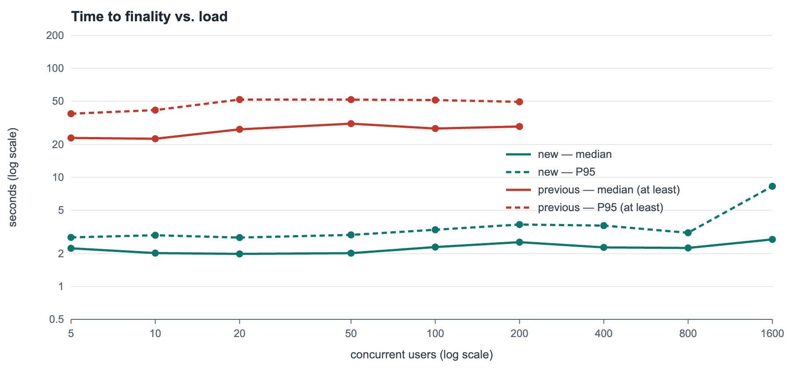
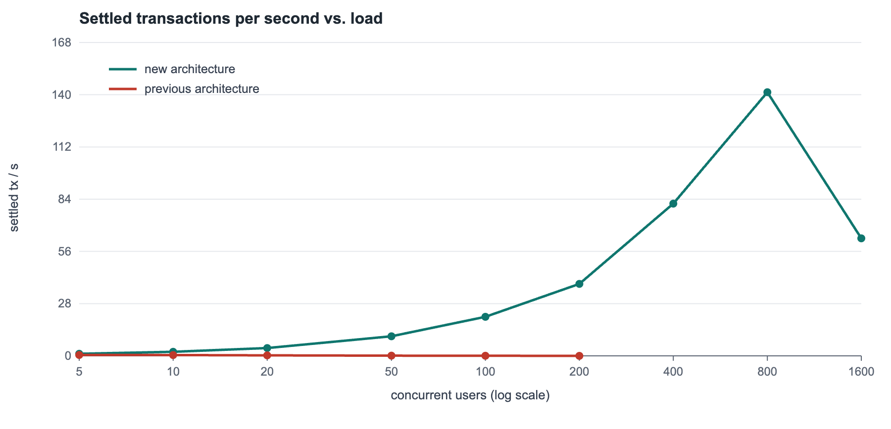

# פרק ביצועים

## שיטת המדידה

- **כלי:** `locustfile.py` (Locust). כל משתמש מדומה הוא ארנק אמיתי: מייצר מפתח P-256, נרשם לשרשרת וחותם בעצמו על כל הזמנה, כמו הארנק.
- **זמן עד סופיות:** מרגע שליחת העסקה החתומה ועד שהיא בבלוק שקיבל commit.
- **עומס:** 5, 10, 20, 50, 100, 200, 400, 800 ו־1,600 משתמשים בו־זמנית, 60 שניות לכל רמה, המתנה של 0.5–2 שניות בין פעולות. תמהיל הפעולות: צפייה בתיק, קנייה, מכירה, פתיחה וסגירה של CFD.
- **סביבה:** כל הרכיבים על מחשב אחד: 4 מאמתי CometBFT, 5 מקורות מחיר חיים, Gateway של Django ומחולל העומס.
- **מגבלת הקצב:** מגבלת הקצב של ה־Gateway הוגדלה (`THROTTLE_TX`), כי כל המשתמשים המדומים יוצאים מאותה כתובת IP.
- **הארכיטקטורה הקודמת** (commit `d1ad844`) נמדדה באותם עומסים. הזמן עד סופיות שלה נלקח ממסד הנתונים. להזמנה שלא אושרה עד סוף הריצה נספר הזמן עד סוף הריצה, ולכן המספרים שלה הם **חסם תחתון**.

שחזור:

```bash
./run.sh start
locust -f locustfile.py --host http://127.0.0.1:8000 --headless -u 50 -r 10 -t 60s --csv results
```

## זמן עד סופיות ותפוקה מול עומס





### הארכיטקטורה החדשה

| משתמשים | חציון | P95 | עסקאות שנסגרו/ש' | כשלים |
|---|---|---|---|---|
| 5 | 2.2 ש' | 2.8 ש' | 1.1 | 0 |
| 10 | 2.0 ש' | 3.0 ש' | 2.1 | 0 |
| 20 | 2.0 ש' | 2.8 ש' | 4.2 | 0 |
| 50 | 2.0 ש' | 3.0 ש' | 10.5 | 0 |
| 100 | 2.3 ש' | 3.3 ש' | 20.9 | 0 |
| 200 | 2.5 ש' | 3.7 ש' | 38.6 | 3 |
| 400 | 2.3 ש' | 3.6 ש' | 81.6 | 0 |
| 800 | 2.3 ש' | 3.1 ש' | 141.3 | 3 |
| 1600 | 2.7 ש' | 8.3 ש' | 63.0 | 0 |

הכשלים הם דחיות עסקיות, כמו יתרה לא מספיקה, ולא תקלות מערכת.

### הארכיטקטורה הקודמת, אותם עומסים

| משתמשים | חציון | P95 | הזמנות שנסגרו/ש' | נסגרו במהלך הריצה |
|---|---|---|---|---|
| 5 | ≥ 23 ש' | ≥ 38 ש' | 0.50 | 30 מתוך 83 |
| 10 | ≥ 23 ש' | ≥ 41 ש' | 0.42 | 25 מתוך 141 |
| 20 | ≥ 28 ש' | ≥ 52 ש' | 0.28 | 17 מתוך 234 |
| 50 | ≥ 31 ש' | ≥ 52 ש' | 0.12 | 7 מתוך 355 |
| 100 | ≥ 28 ש' | ≥ 51 ש' | 0.05 | 3 מתוך 372 |
| 200 | ≥ 29 ש' | ≥ 49 ש' | 0.02 | 1 מתוך 383 |

## התפוקה המרבית ומה מגביל אותה

- **עד 800 משתמשים** התפוקה גדלה באופן ליניארי, עד **141 עסקאות בשנייה**. הזמן עד סופיות נשאר כ־2.3 ש' בחציון ו־3.1 ש' ב־P95.
- **ב־1,600 משתמשים** התפוקה ירדה ל־63 עסקאות בשנייה, ה־P95 עלה ל־8.3 ש', ובקשות נכשלו על פסק זמן בחיבור ל־Gateway.
- **מה הגביל: לא הקונצנזוס.** השימוש במעבד של צומת נשאר מתחת ל־50%, וזמן הבלוק לא השתנה. המגבלות היו:
  - שרת הפיתוח של Django: תהליך אחד, כ־75% של ליבה.
  - מחולל העומס: כ־80% של ליבה, על אותו מחשב.
- **בפריסה אמיתית** ה־Gateway ירוץ בכמה תהליכים מאחורי מאזן עומסים, ונקודת הרוויה תהיה של הרשת עצמה: גודל הבלוק וזמן הבלוק.

## צומת כבוי והחלפת מנהיג

נמדד ב־50 משתמשים, כש־node3 כבוי:

- אפס כשלים, וכ־8.4 עסקאות בשנייה.
- P95 של כ־7 שניות.
- 11 מתוך 39 בלוקים נסגרו בסבב 1. זה התור של node3: הסבב פג, והתור עבר לצומת הבא.
- node3 חזר לאותו `app_hash` בלי התערבות.

## למה הארכיטקטורה הקודמת קורסת

ה־Leader עיבד **הזמנה אחת לכל בלוק**: שאל את ה־Oracle ושלח את הבלוק לכל מאמת בנפרד. מעבר לזה, התפוקה **יורדת** עם העומס: 0.50 הזמנות בשנייה ב־5 משתמשים, ו־0.017 ב־200 משתמשים. הסיבה: ה־Leader מתחרה על אותו שרת Django שמשרת את המשתמשים, וכל בקשה שם עוברת אימות סיסמה (PBKDF2) ונעילת מסד הנתונים. בעומס של 50 משתמשים, דקה אחרי סוף הריצה עוד חיכו 640 הזמנות.

בגרסה החדשה בלוק מכיל את כל העסקאות שבמאגר, ונסגר בערך כל שנייה.

## באג שהתגלה במדידות

במהלך המדידות הרשת הושבתה ונעצרה לצמיתות, אחרי השבתה מלאה של יותר מ־30 שניות. הסיבה:

- זמן הבלוק הבא הוא זמן ה־commit האחרון, כלומר לפני ההשבתה.
- לכן כל ציטוט טרי נראה "מהעתיד", וכל הצעה נדחתה בלי סוף.

**התיקון:** המציע משמיט ציטוטים פגומים, והבלוק הראשון נסגר בלי מחירים. תרחיש קבלה 15 בודק זאת.

## מגבלות המדידה

- כל הרכיבים רצו על מחשב אחד, כך שאין השהיית רשת בין הצמתים.
- מחולל העומס רץ על אותו מחשב ותפס חלק מהמעבד.
- מקורות המחיר חיים, ולכן זמני התגובה שלהם משתנים.
